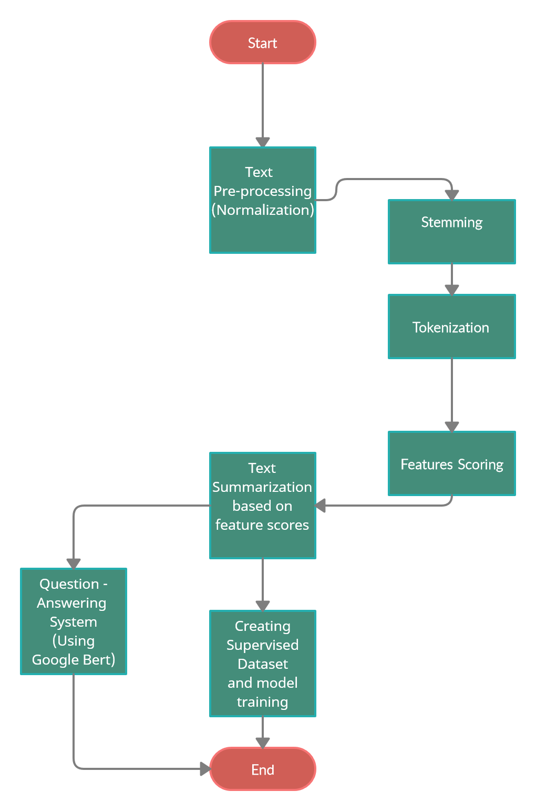

# NLP Project

In this project, we have performed Natural-Language-Processing and Ensemble learning on the Covid-19 documents & summaries and found hidden insights about it. Also, implemented text-summarization techniques and extracted information about features such as sentence_score, cue_phase_score, sentence_position, sentence_length, heading_score, upper_letters, digits, pronoun_words. Along with this, calculated the TF-IDF (“Term Frequency — Inverse Document Frequency”) score, which signifies the importance of the word in the document and corpus. The repository consists of NLP-Chatbot in Flask Framework and a Text-summarization web-app in Streamlit, deployed at Heroku.

 
Github repo of text summarization app: https://github.com/jasminekaur13/text-summarization

Learned about Natural Language Processing techniques, feature-extraction, and conversion of Unsupervised data to Supervised data. Worked with an NLTK python library and learned about different Ensemble-techniques such as bagging, boosting, stacking, AdaBoost. 

## Google bert model

Bert embeddings are useful for keyword/search expansion, semantic search and information retrieval. These representations will help you accuratley retrieve results matching the customer’s intent and contextual meaning, even if there’s no keyword or phrase overlap.

BERT offers an advantage over models like Word2Vec, because while each word has a fixed representation under Word2Vec regardless of the context within which the word appears, BERT produces word representations that are dynamically informed by the words around them. For example, given two sentences:

“The man was accused of robbing a bank.” “The man went fishing by the bank of the river.”

Word2Vec would produce the same word embedding for the word “bank” in both sentences, while under BERT the word embedding for “bank” would be different for each sentence. Aside from capturing obvious differences like polysemy, the context-informed word embeddings capture other forms of information that result in more accurate feature representations, which in turn results in better model performance.

From an educational standpoint, a close examination of BERT word embeddings is a good way to get your feet wet with BERT and its family of transfer learning models, and sets us up with some practical knowledge and context to better understand the inner details of the model in later tutorials.

## Using Bert Model

We have used bert model in order to built question-answering system. Finally, used ``scipy.spatial.distance.cosine`` in order to calculate cosine similarity between text-summaries corpus and questions.

## Han Xiao’s BERT-as-service

Han Xiao created an open-source project named bert-as-service on GitHub which is intended to create word embeddings for your text using BERT. Han experimented with different approaches to combining these embeddings, and shared some conclusions and rationale on the FAQ page of the project.

bert-as-service, by default, uses the outputs from the second-to-last layer of the model.

Han’s perspective:

    - The embeddings start out in the first layer as having no contextual information 
    - As the embeddings move deeper into the network, they pick up more and more contextual information with each layer.
    - The second-to-last layer is what Han settled on as a reasonable sweet-spot.

We have also used BERT-as-service for question- answering system.
 
## Working of Summarization App

